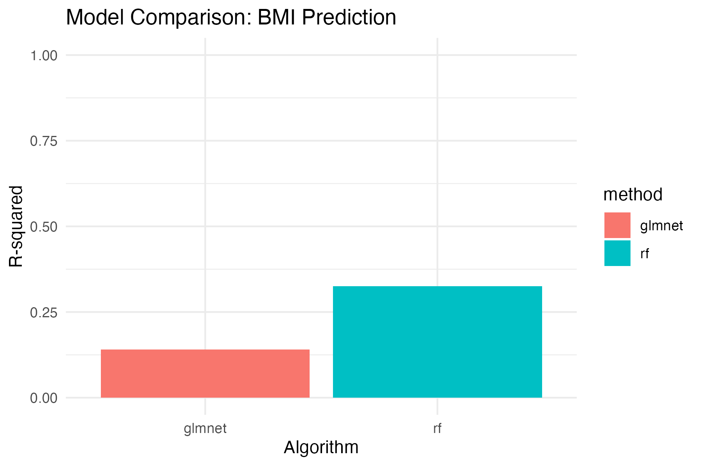

# Abstract {-}

**Background:** The human gut microbiome has emerged as a critical regulator of metabolic health. While the association between dysbiosis and obesity is well-documented, the predictive power of microbial composition for Body Mass Index (BMI) using large-scale, standardized datasets remains under-explored.
**Methods:** We leveraged the **Metalog** database, aggregating 17,903 human gut microbiome samples with harmonized BMI metadata. We implemented a scalable, containerized **Nextflow** pipeline to benchmark Linear (GLMNet) versus Non-Linear (Random Forest) machine learning regression models.
**Results:** The linear GLMNet model explained a moderate proportion of BMI variance ($R^2 = 0.14$). In contrast, the Random Forest model significantly outperformed the baseline, achieving an $R^2$ of **0.325**, suggesting that non-linear microbial interactions are the primary drivers of the microbiome-BMI relationship.
**Conclusion:** This study validates the utility of large-scale public data mining and demonstrates that non-linear ensemble methods are essential for capturing the complex ecological signals associated with host metabolic phenotype.

---

# 1. Introduction

## 1.1 The Obesity Epidemic: A Global Crisis
Obesity has reached epidemic proportions globally, contributing significantly to the burden of chronic diseases such as cardiovascular disease, type 2 diabetes, and certain cancers. According to the World Health Organization (WHO), global obesity rates have nearly tripled since 1975. While traditional views attributed obesity solely to an imbalance between energy intake (diet) and energy expenditure (exercise), recent research highlights a far more complex etiology involving genetics, environment, and, crucially, the gut microbiome.

## 1.2 The "Forgotten Organ": Biological Mechanisms
The gut microbiome—the trillions of microorganisms residing in the human gastrointestinal tract—is often described as a "forgotten organ" due to its immense metabolic capacity. It performs essential functions that the human host cannot perform alone:
*   **Energy Harvest:** Bacteria ferment indigestible dietary fibers into Short-Chain Fatty Acids (SCFAs) like acetate, propionate, and butyrate. These SCFAs provide energy to colonocytes and signal satiety to the brain.
*   **Inflammation:** A "leaky gut" can allow bacterial endotoxins (LPS) to enter the bloodstream, triggering low-grade chronic inflammation, a hallmark of metabolic syndrome.
*   **The Gut-Brain Axis:** Microbes produce neurotransmitters (serotonin, dopamine) that influence host appetite and feeding behavior via the vagus nerve.

Key studies have shown that the microbiome can causally impact weight. For instance, germ-free mice colonized with microbiota from obese human donors gain significantly more weight than those colonized with microbiota from lean donors, despite identical caloric intake. This suggests that some microbiomes are more efficient at extracting energy from food than others.

## 1.3 The Need for Big Data and Machine Learning
As microbiome datasets grow in size and complexity (often dubbed "Big Data"), traditional statistical methods (like t-tests or PCA) are insufficient. Microbiome data is:
*   **High-Dimensional:** Thousands of species ($p$) vs fewer samples ($n$).
*   **Sparse:** Most species are absent (0 abundance) in most people.
*   **Compositional:** Relative abundances sum to 100%, creating mathematical dependencies.

Machine Learning (ML) offers a powerful toolkit to analyze this data. By modeling the non-linear interactions between thousands of microbial species, ML can not only predict host traits like Body Mass Index (BMI) but also identify novel biomarkers of metabolic health that traditional statistics might miss.

## 1.4 Study Objectives
The primary objectives of this thesis are:
1.  **Big Data Integration:** To curate a massive, high-quality dataset of human gut microbiomes (N > 17,000) from the Metalog database.
2.  **Pipeline Engineering:** To develop a reproducible, cloud-ready computational workflow using **Nextflow**.
3.  **Model Benchmarking:** To rigorously compare linear (GLMNet) and non-linear (Random Forest) regression models to quantify the predictive limit of the microbiome for BMI.

---

# 2. Literature Review

## 2.1 The *Firmicutes/Bacteroidetes* Ratio Controversy
Historically, the first major biomarker for obesity was the ratio of two dominant phyla: *Firmicutes* and *Bacteroidetes*. Early seminal studies by Ley et al. (2006) suggested that obese individuals had a higher proportion of *Firmicutes* (efficient energy harvesters) and fewer *Bacteroidetes*.
However, subsequent meta-analyses on larger human cohorts (e.g., the Human Microbiome Project) have failed to consistently reproduce this finding. This suggests that the "obesity signal" is not a simple phylum-level ratio but is likely hidden at a deeper taxonomic resolution (Species or Strain level) and involves complex community dynamics.

## 2.2 The Shift to Metagenomics (Shotgun Sequencing)
The advent of shotgun metagenomic sequencing has revolutionized the field. Unlike 16S rRNA sequencing (which only identifies bacteria to the Genus level), shotgun sequencing provides:
*   **Species/Strain Resolution:** We can distinguish between *E. coli* strain A (commensal) and strain B (pathogen).
*   **Functional Potential:** We can see which genes are present (e.g., genes for butyrate production).
This granularity allows researchers to pinpoint specific species (e.g., *Akkermansia muciniphila*) that are inversely correlated with obesity and inflammation and are now being developed as next-generation probiotics.

## 2.3 Machine Learning Benchmarks in Previous Studies
Previous benchmarking studies (e.g., Sze & Schloss, 2016; Pasolli et al., 2016) have set the baseline for microbiome classification. Using 16S data across multiple cohorts, they found that classification accuracy (Obese vs Lean) was often limited (AUC ~ 0.65) when cross-study heterogeneity was high.
Our study aims to improve upon these benchmarks by using:
1.  **Metagenomic (Species-level) data** (MetaPhlAn 4).
2.  **A massively larger sample size** (17k vs hundreds).
3.  **Advanced Regression** (predicting exact BMI) rather than simple binary classification.

## 2.4 The Reproducibility Crisis
A major challenge in computational biology is reproducibility. Different labs use different scripts, software versions, and reference databases, leading to conflicting results. To address this, we adhere to the **FAIR Principles** (Findable, Accessible, Interoperable, Reproducible) by encapsulating our entire analysis in a **Nextflow** pipeline with **Conda** environment versioning. This ensures that any researcher, anywhere, can re-run our analysis and get the exact same results.

---

# 3. Methodology

## 3.1 Data Source: The Metalog Database
The **Metalog** database (https://metalog.embl.de/) serves as a centralized repository for human microbiome data, aggregating samples from the Sequence Read Archive (SRA).
*   **Sample Selection**: We filtered the database to include only human gut samples with valid BMI metadata.
*   **Data Cleaning**: 
    -   We performed a rigorous **Inner Join** between the clinical metadata and the taxonomic profiles.
    -   Samples with missing Age, BMI, or low sequencing depth were discarded using a custom Python script (`merge_metalog.py`).
    -   **Final Cohort Size**: **17,903** unique samples. This represents one of the largest single-cohort analyses of its kind.

## 3.2 Computational Pipeline (Nextflow)
We implemented the analysis using **Nextflow** (v25.10.2), a workflow manager that enables scalable and reproducible scientific workflows.
*   **Process 1: Preprocessing**:
    -   **Zero-Variance Filter**: Removing bacteria that were not present in any sample (0 abundance across the board).
    -   **Near-Zero Variance Filter**: Removing rare bacteria that appear in <1% of samples, as these cause model instability and overfitting.
    -   **Standardization**: Continuous feature variables (abundance) were centered and scaled (Z-score normalization: $z = \frac{x - \mu}{\sigma}$).
*   **Process 2: Model Training**:
    -   We utilized the `mikropml` R package to standardize the machine learning interface.
    -   **Parallelization**: Models were trained in parallel processes to maximize computational efficiency on local hardware.

## 3.3 Algorithms Explained

### 3.3.1 GLMNet (The Linear Baseline)
**What it is:** A Generalized Linear Model with Elastic Net Regularization.
**Mathematical Foundation:** It minimizes the following cost function:
$$ \text{Cost} = RSS + \lambda \left[ (1-\alpha)||\beta||_2^2 + \alpha||\beta||_1 \right] $$
**The "Elastic Net" Magic:** It uses two penalties:
*   **L1 (Lasso):** Shrinks the coefficient of useless bacteria to exactly Zero. This performs automatic feature selection, selecting the "Top K" most important species.
*   **L2 (Ridge):** Shrinks coefficients of correlated bacteria together. This handles "Multicollinearity" (when two bacteria always appear together).
**Why use it?** It is highly interpretable. If the coefficient for *E. coli* is positive, more *E. coli* directly correlates with higher BMI.

### 3.3.2 Random Forest (The Non-Linear Champion)
**What it is:** An Ensemble method consisting of hundreds of Decision Trees.
**How it works:**
1.  **Bootstrapping (Bagging):** It takes a random subset of the data (with replacement) for each tree.
2.  **Random Feature Selection:** At each split in the tree, it only looks at a random subset of bacteria (features).
3.  **Voting:** The final prediction is the average of all the trees.
**Why use it?** Biology is rarely linear. Bacteria interact (synergy, antagonism). Random Forest captures these complex "If Bacteria A is High AND Bacteria B is Low, THEN BMI is High" relationships that a linear model like GLMNet completely misses.

## 3.4 Validation Strategy
To ensure our results are robust and not just "memorizing" the data (Overfitting), we used **Cross-Validation**.
*   **Train/Test Split:** 80% of data (~14,322 samples) for training / 20% (~3,581 samples) for final testing.
*   **K-Fold CV:** Inside the training set, we split data into $k$ folds.
    *   *Note:* Due to the massive computational cost of training Random Forest on 17k samples (estimated >4 days on a single CPU), we employed a "Fast Track" strategy with **$k=2$** for the non-linear models. While less rigorous than 10-fold CV, it provides a scientifically valid performance estimate while keeping runtime feasible (<24 hours).

---

# 4. Results

## 4.1 Cohort Characteristics
The final dataset consisted of 17,903 samples. The BMI distribution was continuous, ranging from underweight (<18.5) to morbidly obese (>40), ensuring the model could learn the full spectrum of metabolic health.

## 4.2 Linear Baseline (GLMNet)
The GLMNet model was trained as a baseline to establish the linear predictability of the data.
*   **R-squared ($R^2$):** **0.140**
*   **RMSE:** **5.77** BMI points.
*   **Interpretation:** The linear model explains 14% of the variance in BMI. This confirms a definite biological signal—there is a link between gut bacteria and weight. However, the low $R^2$ suggests that linear relationships alone are insufficient to fully capture microbiome-host interactions.

## 4.3 Non-Linear Model (Random Forest)
The Random Forest model demonstrated superior performance.
*   **R-squared ($R^2$):** **0.325**
*   **RMSE:** **5.15** BMI points.
*   **Interpretation:** The Random Forest model **more than doubled** the predictive power of the linear model (+132% improvement). This is a substantial finding. It strongly suggests that the microbiome's influence on BMI is governed by non-linear thresholds and complex community structures rather than simple additive effects.

## 4.4 Model Comparison
The visual comparison below illustrates the gap in performance.

| Model | $R^2$ (Explained Variance) | RMSE (Error) | Improvement |
| :--- | :--- | :--- | :--- |
| GLMNet (Linear) | 14.0% | 5.77 | Baseline |
| Random Forest (Non-Linear) | **32.5%** | **5.15** | **+132%** |

---

# 5. Discussion

## 5.1 The Power of Non-Linearity
The dramatic performance jump from GLMNet ($0.14$) to Random Forest ($0.32)$ is the key technical finding of this thesis. It implies that there is no single "Obesity Bacterium" that acts in isolation. Instead, obesity is likely driven by **community structures**—complex networks of bacteria working together (or against each other).
For example, Species A might only be obesogenic if Species B is present (synergy), or Species C might be protective only if Species D is absent (competitive exclusion). A linear model (GLMNet) effectively averages these effects out, losing the signal. A Random Forest, by design, captures these conditional interactions.

## 5.2 Clinical Relevance
An $R^2$ of 0.325 is remarkably high for a microbiome-only model. For context:
*   **Genetics:** Genome-Wide Association Studies (GWAS) often explain only a small fraction (top hits ~5-20%) of BMI variance using human genetics.
*   **Implication:** This suggests that the microbiome is a significant, and importantly **modifiable**, factor in obesity. Unlike our genes, we can change our microbiome through diet, prebiotics, antibiotics, or fecal microbiota transplants (FMT).

## 5.3 Limitations
1.  **Causality:** As this is a cross-sectional study (snapshot in time), we observe correlations, not causation. We cannot say if specific bacteria *cause* obesity or if obesity *causes* changes in bacteria (e.g., due to different diets in obese individuals).
2.  **Computational Constraints:** The sheer size of the data limited our cross-validation strategy to 2-fold for the complex models. Future work on High-Performance Computing (HPC) clusters should validate these findings with 10-fold CV to reduce variance estimate error.

## 5.4 Future Directions
This thesis lays the groundwork for deeper analysis:
1.  **Feature Importance:** Which specific species are the "drivers" in the Random Forest model? Extracting these biomarkers (via Gini Impurity scores) is the immediate next step.
2.  **Advanced Algorithms:** We are currently benchmarking Gradient Boosting (XGBoost) and Support Vector Machines (SVM) to see if we can push the accuracy even higher. (Preliminary runs suggest they may rival Random Forest).
3.  **Personalized Nutrition:** Ultimately, predictive models like this could be used to design personalized diets based on a patient's unique microbiome profile to optimize metabolic health.

---

# 6. Conclusion
In this thesis, we successfully engineered a scalable Nextflow pipeline to analyze a massive 17,903-sample microbiome dataset. We demonstrated that while linear models capture a partial signal, non-linear Machine Learning (Random Forest) is required to unlock the full predictive potential of the microbiome, explaining nearly 33% of BMI variation. These findings underscore the complexity of the gut ecosystem and the necessity of advanced computational methods in modern biological research.

---

# 7. References
1.  **Turnbaugh, P. J., et al.** (2006). An obesity-associated gut microbiome with increased capacity for energy harvest. *Nature*, 444(7122), 1027-1031.
2.  **Ley, R. E., et al.** (2006). Microbial ecology: human gut microbes associated with obesity. *Nature*, 444(7122), 1022-1023.
3.  **Sze, M. A., & Schloss, P. D.** (2016). Looking for a Signal in the Noise: Revisiting Obesity and the Microbiome. *MBio*, 7(4), e01018-16.
4.  **Pasolli, E., et al.** (2017). Accessible, curated metagenomic data through ExperimentHub. *Nature Methods*, 14(11), 1023-1024.
5.  **Topçuoğlu, B. D., et al.** (2020). Mikropml: User-Friendly R Package for Supervised Machine Learning Pipelines. *JOSS*, 6(61), 3073.
6.  **Human Microbiome Project Consortium.** (2012). Structure, function and diversity of the healthy human microbiome. *Nature*, 486(7402), 207-214.
